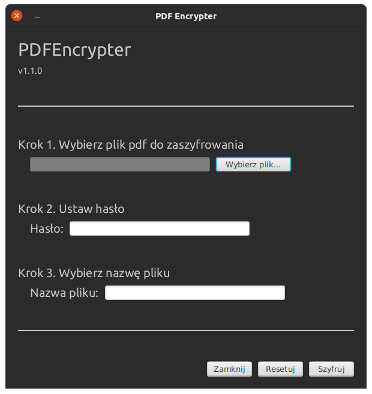
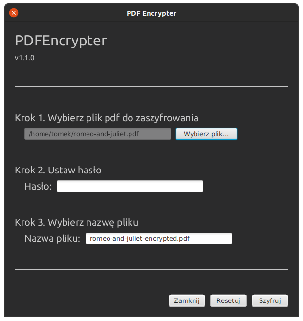
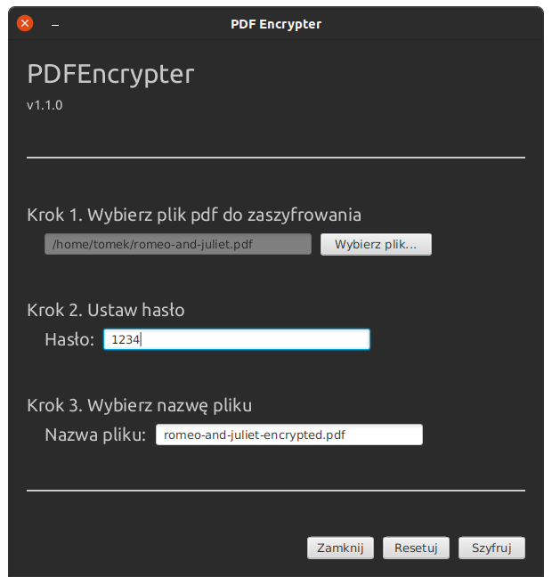

# PDF Encrypter

## Description

A simple GUI app that enables PDF files encryption in UNIX operating systems.
The app executes `pdftk` command.

To install `pdftk` on Ubuntu, run:
```shell
sudo add-apt-repository ppa:malteworld/ppa
sudo apt update
sudo apt install pdftk
```


## Usage

Once you run the program, the following window appears.



You can now select the file you want to encrypt by pressing the 'Wybierz plik...' button. The default name for the encypted file will appear in the third text field as shown below.



You can now set the password. Note that the password is passed by a plain text.



You can change the output name if you want and press the 'Szyfruj' button. As a result, the following will popup be prompted if the encryption succeeds.


The encrypted file can now be found in the same directory as input.

There are also two warning popups.
1. If the typed password is an empty string:


2. If the typed password includes forbidden symbols.


If an error occurs while encypting, the following message appears:


